<div id="top" align="center">

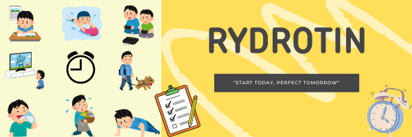

</div>
<!-- PROJECT LOGO -->
<div align="center">
<h1 align="center">RydRotin</h1>
  
  <h3 align="center">
    Habit Tracker Application<br /><br /> Mobile Application Development <br />International University - VNU
    <br />
    <br />
    <a href="https://github.com/congbangitiu/RydRotin-Habit-Tracker">Report Bug</a>
    ·
    <a href="https://github.com/congbangitiu/RydRotin-Habit-Tracker">Request Feature</a>
  </h3>

[![Contributors][contributors-shield]][contributors-url]
[![Forks][forks-shield]][forks-url]
[![Issues][issues-shield]][issues-url]

</div>

<!-- Table contents -->

# Table of Contents

- [📚 About](#about)
  - [👥 The Team Behind It](#1-the-team-behind-it)
  - [📈 The Project We Are Working On](#2-the-project-we-are-working-on)
  - [🎯 Goal](#3-goal)
- [🚀 Reason](#reason)
  - [💡 Motivation](#1-motivation)
  - [💭 Idea](#2-idea)
  - [🛤 Roadmap](#3-roadmap)
- [🛠 Technologies Used](#technologies)
- [🧩 Methodology](#methodology)
  - [🔍 Feature Analysis](#1-feature-analysis)
  - [🏗 MVVM Modern Architectural Pattern](#2-mvvm-modern-architectural-pattern)
  - [🔗 Integrating MVVM Pattern in FurniScape](#3-integrating-mvvm-pattern-in-furniscape)
- [📊 Diagrams](#diagrams)
  - [🔄 Sequence Diagrams](#1-sequence-diagrams)
  - [📐 Class Diagram](#2-class-diagram)
  - [🔧 User Interaction Diagrams](#3-user-interaction-diagrams)
  - [📜 Use Case Diagram](#4-use-case-diagram)
- [🔧 Installation](#installation)
- [📸 Demo - Result](#demo---result)
  - [🔄 User Mode](#1-user)
  - [📐 Admin Mode](#2-admin)
- [🤝 Contributing](#contributing)
- [📄 License](#license)
- [📧 Contact](#contact)
- [🙏 Acknowledgements](#acknowledgements)

<!-- About -->

# 📚 ABOUT

## 1. The team behind it

| No. |       Full Name       | Student's ID |              Email               |                 Github account                  |                 Roles                  | Contribution |
| :-: | :-------------------: | :----------: | :------------------------------: | :---------------------------------------------: | :------------------------------------: | :----------: |
|  1  |     Nguyen Luan Cong Bang      | ITITIU20163  | ITITIU20163@student.hcmiu.edu.vn |     [congbangitiu](https://github.com/congbangitiu)     | Project Manager  |     16.67%      |
|  2  |     Pham Gia Bao      | ITITIU20166  | ITCSIU20166@student.hcmiu.edu.vn |    [giabao18](https://github.com/giabao18)    |           Back-end Developer           |     16.67%      |
|  3  | Pham Minh Vu | ITITIU20354  | ITITIU20354@student.hcmiu.edu.vn | [PMinhVu](https://github.com/PMinhVu) |          Front-end Developer           |     16.67%      |
|  4  |     Truong Duc Duy Khang      | ITITIU20227  | ITITIU20227@student.hcmiu.edu.vn |      [ITITIU20227](https://github.com/ITITIU20227)      |          UI/UX Designer           |     16.67%      |
|  5  |     Bui Nhat Quang Truong      | ITITIU20333  | ITITIU20333@student.hcmiu.edu.vn |      [TrgDz](https://github.com/TrgDz)      |          Back-end Developer           |     16.67%      |
|  6  |     Nguyen Huy Hung      | ITCSIU21064  | ITCSIU21064@student.hcmiu.edu.vn |      [HungTouya](https://github.com/HungTouya)      |          Back-end Developer           |     16.67%      |

## 2. The project we are working on

**RydRotin** is a mobile app designed to help users establish and sustain daily routines through habit tracking and emotional state monitoring. The app offers features like creating, modifying, and tracking habits, managing habit history, and maintaining streaks. With visually appealing charts, it provides clear progress insights, fostering motivation and self-reflection. Developed with a systematic approach, **RydRotin** ensures functionality and user-friendliness, catering to both beginners and experienced users. By combining habit management with progress visualization, the app encourages consistency, boosts productivity, and supports personal growth.

## 3. Objectives

By providing a thorough and organized tracking system that makes habit monitoring easier, this initiative aims to assist users in maintaining healthy behaviors. In order to help users better comprehend their path, the program seeks to provide tools that monitor progress successfully via simple and understandable graphics. The app's integration of mood monitoring gives users the ability to assess how their behaviors affect their mental health and offers insightful information about their general well-being. The program promotes long-term habit maintenance and helps users lead healthier and more productive lives. It is a simple but powerful platform.


<!-- Technologies Used -->

# 🛠 TECHNOLOGY

- **Frontend:** XML 

- **Backend:** Kotlin, Java

- **Database:** Room

- **Version Control:** Github

- **Ide:** Android Studio

<!-- Diagrams -->

# 📊 DIAGRAM

## 1. User flow Diagram
<div align="center">
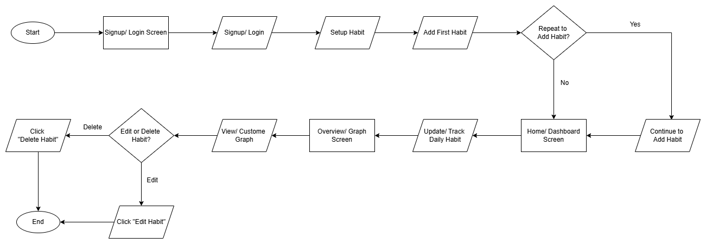
</div>

## 2. Use Case Diagram
<div align="center">
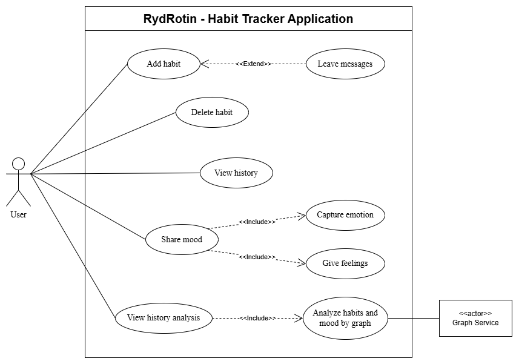
</div>

## 3. Entity-Relationship Diagram (ERD)
<div align="center">
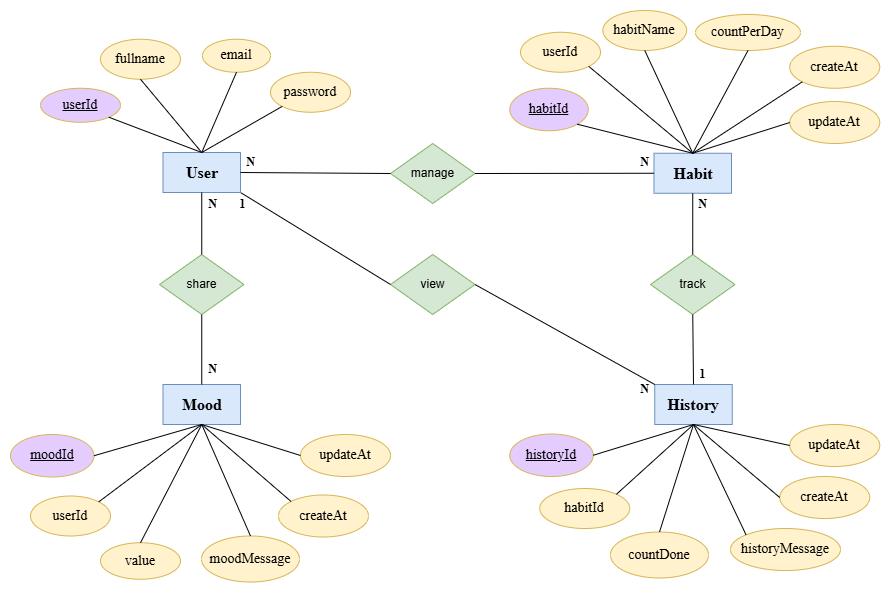
</div>

## 4. Class Diagram
<div align="center">
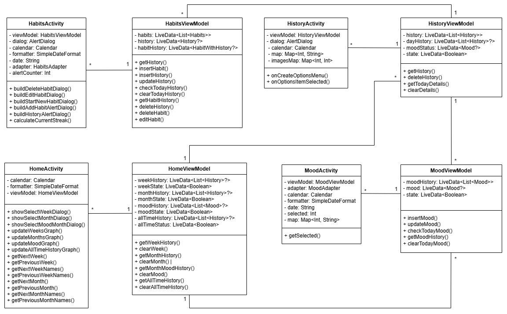
</div>

## 5. MVVM model
<div align="center">
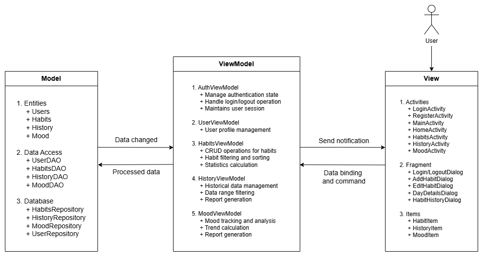
</div>

## 6. Sequence Diagrams

**6.1. Log in** 
<div align="center">
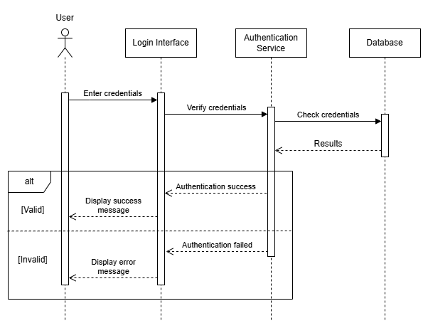
</div>

**6.2. Register** 
<div align="center">
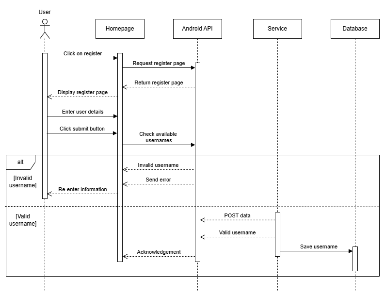
</div>

**6.3. Add a habit** 
<div align="center">
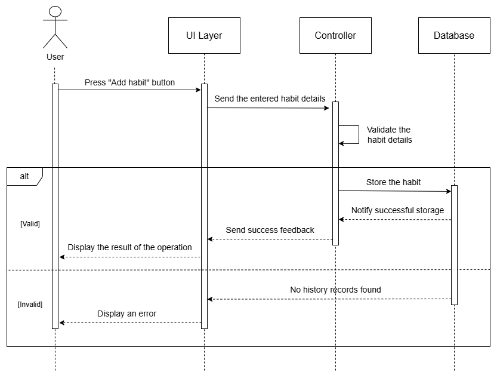
</div>

**6.4. View the history of a specific habit** 
<div align="center">
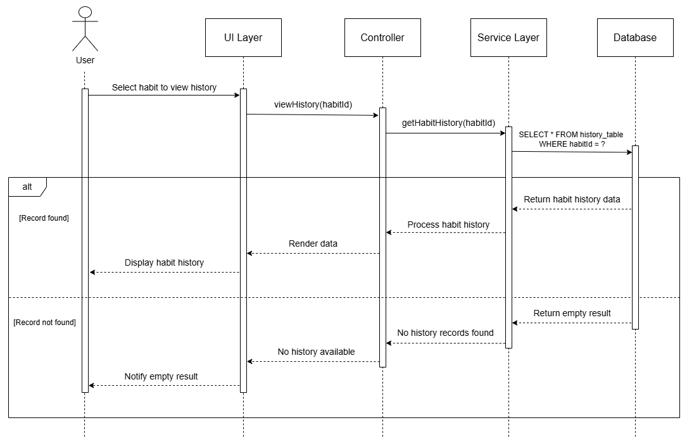
</div>

**6.5. Generate a progress graph from a selected date** 
<div align="center">
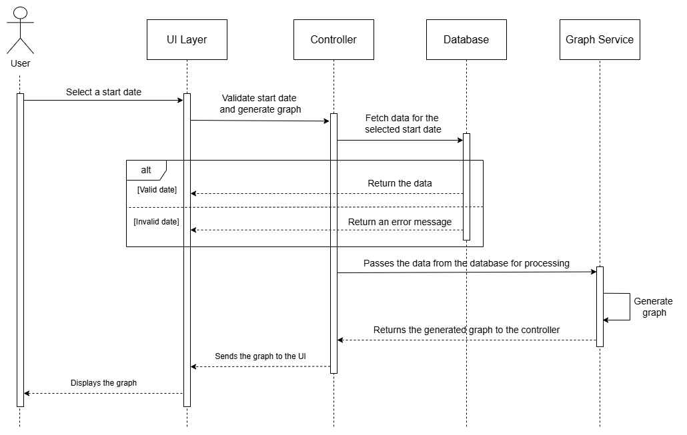
</div>

<!-- INSTALLATION -->

# 🔧 INSTALLATION

### Steps:

1. Clone the repo
   ```sh
   git clone https://github.com/congbangitiu/RydRotin-Habit-Tracker.git
   ```
2. Open in Android Studio
3. Wait for building Gradle files
4. Run the app on your device or emulator


# 📸 DEMO - RESULT

## 1. Splash Screen
<p align="center">
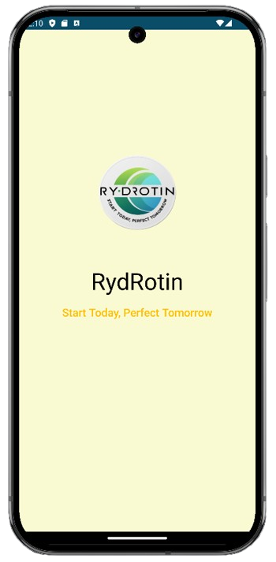
</p>

## 2. Login Screen
<p align="center">
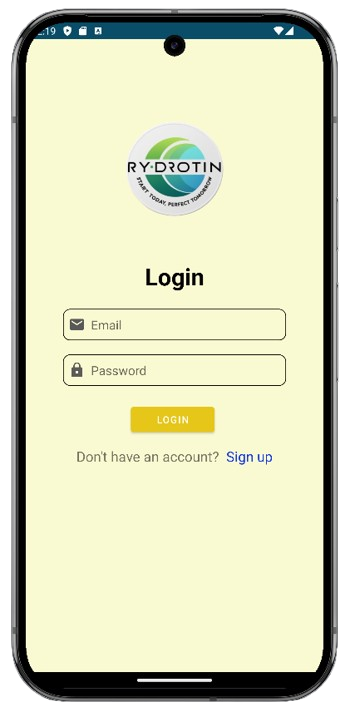
</p>

## 3. Registration Screen
<p align="center">
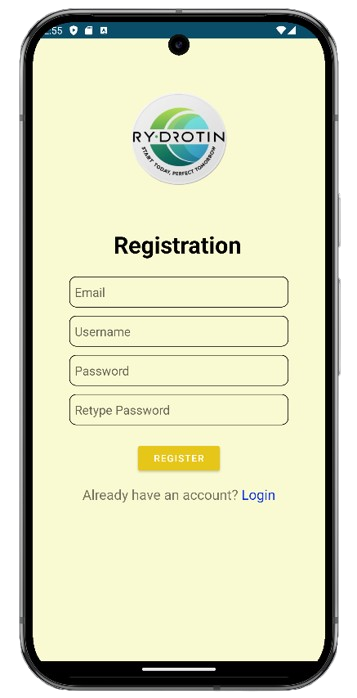
</p>

## 4. Home Screen
<p align="center">
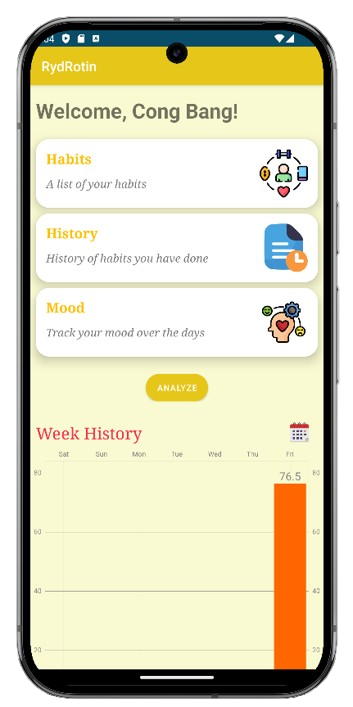
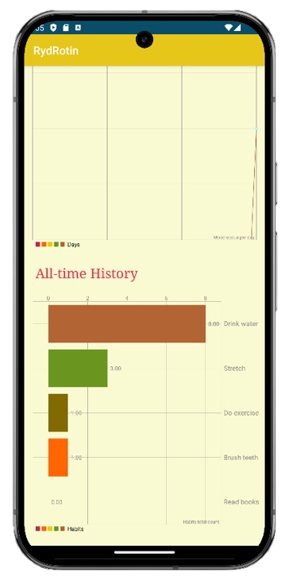
</p>

## 5. Habit Screen
<p align="center">
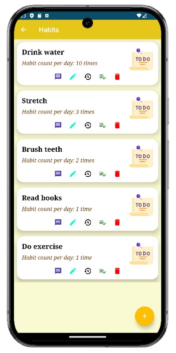
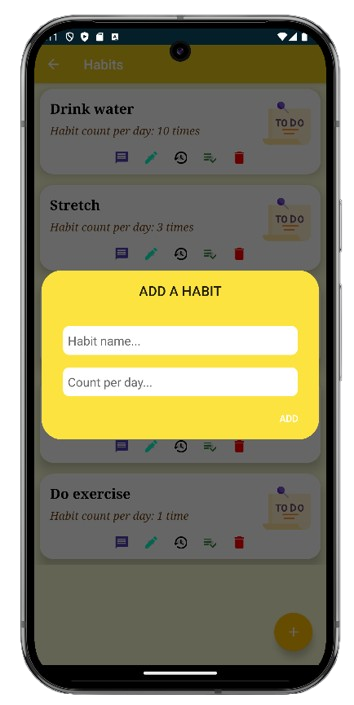
</p>

## 6. History Screen
<p align="center">
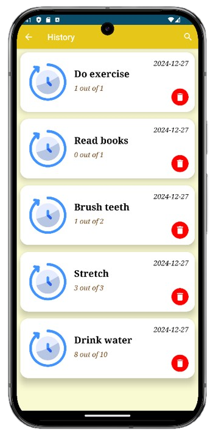
</p>

## 7. Mood Screen
<p align="center">
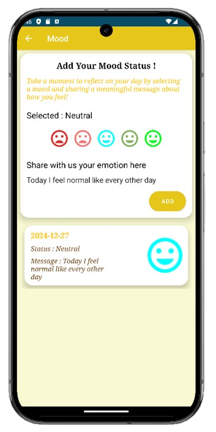
</p>

**(and more screenshots hidden for you to explore yourself in our application...)**

<!-- CONTRIBUTING -->

# 🤝 CONTRIBUTING

Contributions are what make the open source community such an amazing place to learn, inspire, and create. Any
contributions you make are **greatly appreciated**.

If you have a suggestion that would make this better, please fork the repo and create a pull request. You can also
simply open an issue with the tag "enhancement".
Don't forget to give the project a star! Thanks again!

1. Fork the Project
2. Create your Feature Branch (`git checkout -b feature/AmazingFeature`)
3. Commit your Changes (`git commit -m 'Add some AmazingFeature'`)
4. Push to the Branch (`git push origin feature/AmazingFeature`)
5. Open a Pull Request

# 📄 LICENSE

This project is licensed under MIT License. See the [License](https://github.com/congbangitiu/RydRotin-Habit-Tracker/blob/main/LICENSE) file for details.

<!-- CONTACT-->

# 📧 CONTACT

For any inquiries of feedback, please contact:

- Nguyen Luan Cong Bang by **[Email HERE](mailto:ITITIU20163@student.hcmiu.edu.vn)**

- Project Link: [https://github.com/congbangitiu/RydRotin-Habit-Tracker](https://github.com/congbangitiu/RydRotin-Habit-Tracker)

You can also reach out to other team members:
- **[Pham Gia Bao](mailto:ITITIU20166@student.hcmiu.edu.vn)**
- **[Pham Minh Vu](mailto:ITITIU20354@student.hcmiu.edu.vn)**
- **[Truong Duc Duy Khang](mailto:ITITIU20227@student.hcmiu.edu.vn)**
- **[Bui Nhat Quang Truong](mailto:ITITIU20333@student.hcmiu.edu.vn)**
- **[Nguyen Huy Hung](mailto:ITCSIU21064@student.hcmiu.edu.vn)**


<!-- ACKNOWLEDGMENTS -->

# 🙏 ACKNOWLEDGEMENTS

We want to express our sincerest thanks to our lecturer and the people who have helped us to achieve this project's
goals:

- []() Dr. Le Duy Tan
- []() The README.md template from **[othneildrew](https://github.com/othneildrew/Best-README-Template)**

<!-- MARKDOWN LINKS & IMAGES -->

[contributors-shield]: https://img.shields.io/github/contributors/congbangitiu/RydRotin-Habit-Tracker.svg?style=for-the-badge
[contributors-url]: https://github.com/congbangitiu/RydRotin-Habit-Tracker/graphs/contributors
[forks-shield]: https://img.shields.io/github/forks/congbangitiu/RydRotin-Habit-Tracker.svg?style=for-the-badge
[forks-url]: https://github.com/congbangitiu/RydRotin-Habit-Tracker/network/members
[issues-shield]: https://img.shields.io/github/issues/congbangitiu/RydRotin-Habit-Tracker.svg?style=for-the-badge
[issues-url]: https://github.com/congbangitiu/RydRotin-Habit-Tracker/issues


